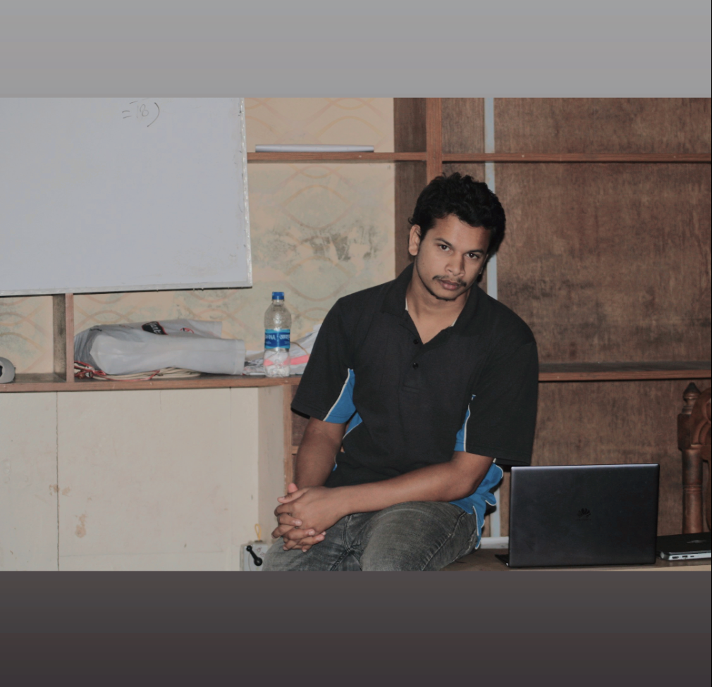

# MYSCHOOL

**a school manegement software**

``` json
{
  "author": "alif_nayon",
  "project": "myschool",
  "version": "beta version"
}
```

> nothing is perfect

---

**code by alifn**


[Website](https://www.alifn.seawebit.com)
[Linkedin](https://www.linkedin.com/in/alifn-nayon-472821265/)
[Github](https://github.com/3alifn)
[Facebook](https://www.facebook.com/alifnayon30)


Thanks for see.
